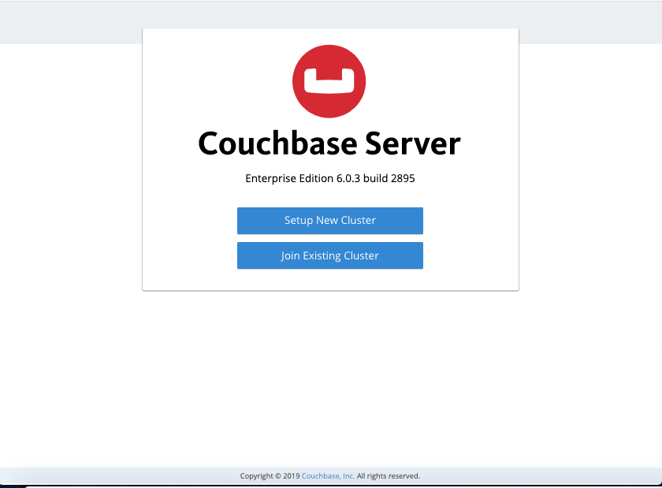
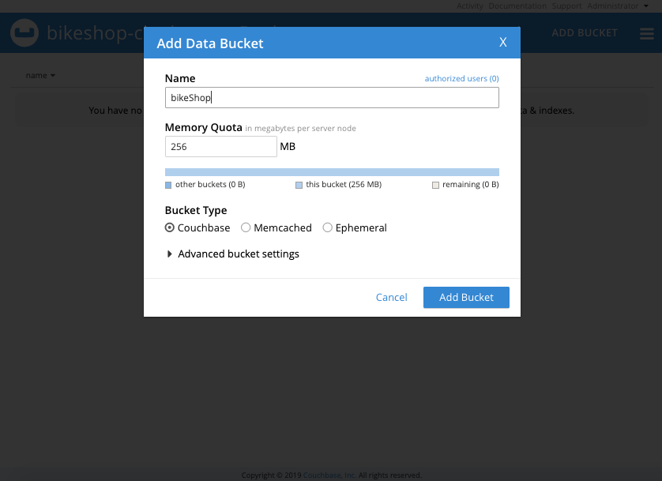
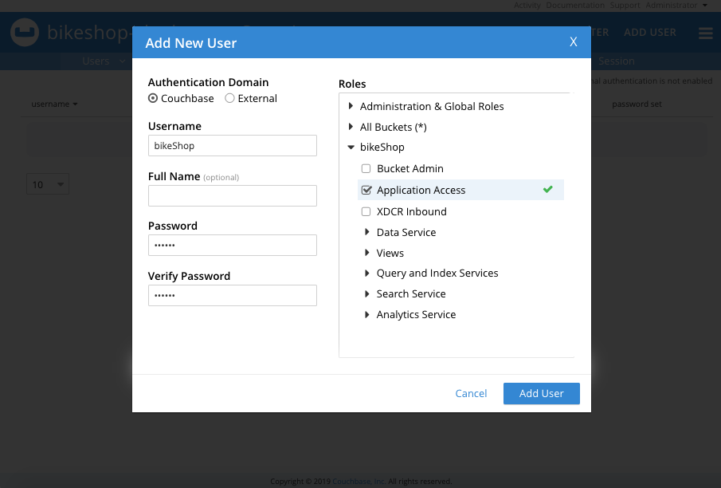

# bikeshop-cb
Node.js Example Application for Couchbase using the Ottoman ODM

## QuickStart with Couchbase Server and Docker
Here is how to get a single node Couchbase Server cluster running on Docker Compose:

**Step - 1** : Build the app with docker-compose

```console
docker-compose build
```

**Step - 2** : Run the app with docker-compose

```console
docker-compose up
```

**Step - 3** : Next, visit `http://localhost:8091` on the host machine to see the Web Console to start Couchbase Server setup.



**Step - 4** : Create a new bucket named *bikeShop*.



**Step - 5** : Add new user named *bikeShop* with role **Application Access**.



**Step - 6** : Create `.env` file with password the user *bikeShop*.

```
DB_BUCKET_PASSWORD=*****
```

**Step - 7** : See the request documentation at 
[https://documenter.getpostman.com/view/1710498/SzmmUEKR](https://documenter.getpostman.com/view/1710498/SzmmUEKR).
